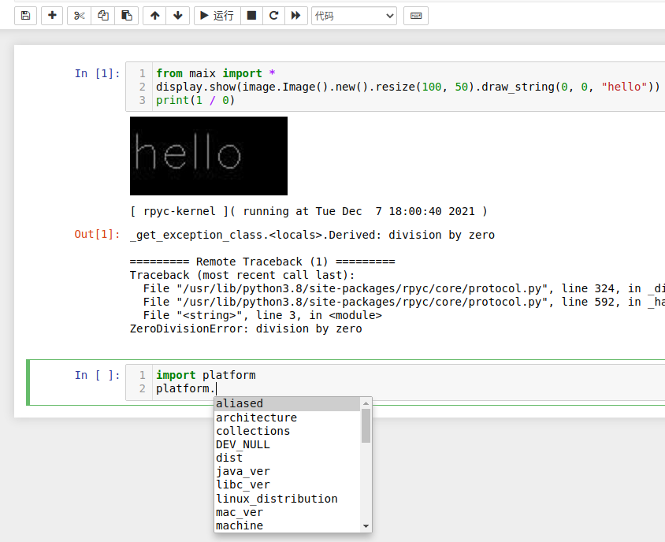

<p align="center">
    <h1 align="center"> RPyC の IPykernel </h1>
</p>

[](./LICENSE)
[](https://badge.fury.io/py/rpyc-ikernel)

## Kernel installation

- pip install rpyc_ikernel
- python -m rpyc_ikernel.install



## Kernel introduction

Inherit the IPythonKernel (iPython) class, and support low-end hardware (armv7l) for Python programming and real-time image and video streaming with less occupation 16M.

- Implement remote call (RPC) core through [rpyc](https://github.com/tomerfiliba-org/rpyc), see this [docs](http://rpyc.readthedocs.org/).

- Set up an RPC service for the remote machine with [MaixPy3](https://github.com/sipeed/MaixPy3) and transfer the local code to the remote (remote) to run & display images & get results.

### Special functions

| Command format | Command function | How to use |
| ---- | ---- | ---- |
| $connect("localhost") | Connect to the remote IP address (for example: "192.168.44.171:18812") | [usage_connect.ipynb](./tests/usage_connect.ipynb) |

## installation method

Explain in the following order:

- Configure rpyc service for [Remote Python].
- Install jupyter environment for [Local Python].

## Configure rpyc service for [Remote Python].

Use **ifconfig** or **ipconfig** on your remote device to get your IP address, please make sure that the address can be **ping**.

### MaixPy3 series

Make sure that the remote device is configured in the **Python3** environment, enter `pip3 install maixpy3` to install the **rpyc** service, copy the following command and run it to start the service.

```shell
python -c "import maix.mjpg;maix.mjpg.start()"
```

### Other environmental

The following code provides the remote call environment.

```python
try:
  from rpyc.utils.server import ThreadedServer
  from rpyc.core.service import SlaveService
  rpyc_server = ThreadedServer(
      SlaveService, hostname=HostName, port=RpycPort, reuse_addr=True)
  rpyc_server.start()
except OSError as e:
  # logging.debug('[%s] OSError: %s' % (__file__, str(e))) # [Errno 98] Address already in use
  exit(0)
```

At this time your rpyc service has been up.

## Install jupyter environment for [local Python].

Take Python3 as an example, please make sure that the basic environment/commands of python3 and pip3 have been installed, just call the code under the command line.

```shell
pip3 install rpyc_ikernel && python3 -m rpyc_ikernel.install
```

Tsinghua source can be used for domestic download acceleration.

```shell
pip3 install -i https://pypi.tuna.tsinghua.edu.cn/simple rpyc_ikernel && python3 -m rpyc_ikernel.install
```

After the above package is installed, enter `jupyter notebook` to start the service. After startup, the system default browser will be opened automatically (recommended foreign Google browser or domestic 360 speed browser), please select the kernel of rpyc and create a new (new) designation The code file of the kernel.


If you don't see it, you can enter `python3 -m rpyc_ikernel.install` to complete the kernel installation, and you can see it now.

### On Windows

enter `python -m rpyc_ikernel.install` to complete the kernel installation.

If there are the following common errors that cannot find modules, they are common in py2 and py3 environments. Please confirm whether the system environment variable is python / pip command.

- `/usr/bin/python3: Error while finding module specification for'rpyc-ikernel.install' (ModuleNotFoundError: No module named'rpyc-ikernel')`
- `/usr/bin/python: No module named rpyc-ikernel`

> For some machine environment variables, python3 is python, or multiple versions of python and pip coexist, then the python command is required at this time.

You can enter `jupyter kernelspec list` to view the currently installed jupyter kernel. If there is no rpyc, the kernel is not installed.

```shell
Available kernels:
  bash /home/juwan/.local/share/jupyter/kernels/bash
  micropython /home/juwan/.local/share/jupyter/kernels/micropython
  python3 /home/juwan/.local/share/jupyter/kernels/python3
  rpyc /home/juwan/.local/share/jupyter/kernels/rpyc
```

## Run Python code in Notebook

Before running the code, please configure the IP address to connect, otherwise it will connect to the "localhost" address to request the service by default.

```python
$connect("192.168.43.44")
import platform
print(platform.uname())
```

It can be seen that the returned results are as follows:

```shell
uname_result(system='Linux', node='linux-lab', release='5.4.0-56-generic', version='#62-Ubuntu SMP Mon Nov 23 19:20:19 UTC 2020', machine= 'x86_64', processor='x86_64')
```

## common problem

You can troubleshoot problems in the following order:

### Environmental issues

When you find that there is no response after the Python code is executed, you can follow the steps below to troubleshoot the error.

- Check if the rpyc service of the remote device exists/runs. (Ps -a)
- If pressing the interrupt button fails to stop while the code is still running, please refresh the code page or restart the kernel and try to execute the code again.
- Restart the jupyter service and reconnect to the remote device to execute code.

If it still does not work, it may be a network problem, so continue to troubleshoot.

### Internet problem

Make sure that the local machine can connect to the remote machine, and use Ping or socket to connect.

- Determine the network to which the machine belongs, and try to ping the IP address of the slave machine.
- Determine the network to which the remote end belongs, and try to ping the host IP address.
- Make sure that the forwarding rules of the upper router do not restrict the service ports 18811, 18812, 18813.

### other problems

Unplug the network cable or restart the machine, reset the hardware and other reset operations.

## Design inspiration

The kernel design is taken from the following Python repository.

- [maixpy3](https://github.com/sipeed/maixpy3)
- [ipykernel](https://github.com/ipython/ipykernel)
- [rpyc](https://github.com/tomerfiliba-org/rpyc)

The reference kernel is as follows.

- [bash_kernel](https://github.com/takluyver/bash_kernel)
- [ubit_kernel](https://github.com/takluyver/ubit_kernel)
- [remote_ikernel](https://github.com/tdaff/remote_ikernel)
- [jupyter_micropython_kernel](https://github.com/goatchurchprime/jupyter_micropython_kernel)
