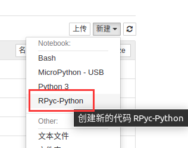

<p align="center">
    <h1 align="center"> RPyC の IPykernel </h1>
</p>

[](./LICENSE)
[](https://badge.fury.io/py/rpyc-ikernel)

[English Readme](README.md)

## 内核安装方式

- pip install rpyc_ikernel
- python -m rpyc_ikernel.install


## 内核简介

本内核继承了IPythonKernel(iPython)类并且支持了低端的硬件(armv7l)，能在占用不超过16MB下运行Python编程、实时的图像和视频流

- 通过[rpyc](https://github.com/tomerfiliba-org/rpyc)实现了远程访问(RPC)内核，详见此[文档](http://rpyc.readthedocs.org/)

- 为运行[MaixPy3](https://github.com/sipeed/MaixPy3)的远端机器建立了一个RPC服务，来在本地和远程设备之间传输代码并显示图像和结果

### 特殊的函数

| 命令格式 | 命令用途 | 命令用法 |
| ---- | ---- | ---- |
| $connect("localhost") | 连接到远程的IP (例如: "192.168.44.171:18812") | [usage_connect.ipynb](./tests/usage_connect.ipynb) |

## 安装方法

按以下顺序介绍

- 为[远端 Python]配置rpyc服务
- 为[本地 Python]配置jupyter环境

## 为[远端 Python]配置rpyc服务.

在远端设备上使用**ifconfig** 或 **ipconfig**命令获取它的IP地址，并且确保这个地址能被**ping**到

### MaixPy3 系列

确保远端设备已经被配置为了**Python3**环境，输入`pip3 install maixpy3`来安装**rpyc**服务，拷贝以下命令并且运行来启动服务

```shell
python -c "import maix.mjpg;maix.mjpg.start()"
```

### 其他环境

以下代码可以提供一个远程访问环境

```python
try:
  from rpyc.utils.server import ThreadedServer
  from rpyc.core.service import SlaveService
  rpyc_server = ThreadedServer(
      SlaveService, hostname=HostName, port=RpycPort, reuse_addr=True)
  rpyc_server.start()
except OSError as e:
  # logging.debug('[%s] OSError: %s' % (__file__, str(e))) # [Errno 98] Address already in use
  exit(0)
```

现在你的rpyc服务已经配置好了

## 为[本地 Python]配置jupyter环境

以Python3为例，请确保安装了基本的python3和pip3环境和命令行。只需要运行下面这一行代码。

```shell
pip3 install rpyc_ikernel && python3 -m rpyc_ikernel.install
```

大陆的用户可以使用清华源来加速

```shell
pip3 install -i https://pypi.tuna.tsinghua.edu.cn/simple rpyc_ikernel && python3 -m rpyc_ikernel.install
```

装完以上的包之后，可以通过输入`jupyter notebook`来启动服务。启动之后，系统默认的浏览器会自动打开（建议使用Chrome和360浏览器极速版）。请选择rpyc内核并新建一个使用该内核的文件



如果你没有看见它，你可以输入`python3 -m rpyc_ikernel.install`来完成内核的安装，然后就可以看到了。

### 对于 Windows

输入`python -m rpyc_ikernel.install`来完成内核的安装

如果有如下常见的找不到模块的错误，它们常见于py2和py3混装的环境，请检查用的python和pip的版本和环境变量。

- `/usr/bin/python3: Error while finding module specification for'rpyc-ikernel.install' (ModuleNotFoundError: No module named'rpyc-ikernel')`
- `/usr/bin/python: No module named rpyc-ikernel`

> 对于有些机器的环境，python3被命名为python；或者存在多个版本的python和pip，那么此时需要正确选择使用的python命令。

你可以输入`jupyter kernelspec list`来检查正确安装的jupyter内核。如果这里没有rpyc，那么这个内核就还没被安装。

```shell
Available kernels:
  bash /home/juwan/.local/share/jupyter/kernels/bash
  micropython /home/juwan/.local/share/jupyter/kernels/micropython
  python3 /home/juwan/.local/share/jupyter/kernels/python3
  rpyc /home/juwan/.local/share/jupyter/kernels/rpyc
```

## 在Jupyter NoteBook中运行Python

在运行代码之前，清配置ip地址以连接，否则，它会默认地连接到"localhost"地址请求服务。

```python
$connect("192.168.43.44")
import platform
print(platform.uname())
```

然后就可看到如下的返回结果

```shell
uname_result(system='Linux', node='linux-lab', release='5.4.0-56-generic', version='#62-Ubuntu SMP Mon Nov 23 19:20:19 UTC 2020', machine= 'x86_64', processor='x86_64')
```

## 常见问题

你可以按以下顺序排除问题：

### 环境问题

当您发现执行Python代码后没有响应时，可以按照以下步骤进行错误诊断。

- 检查远程设备的rpyc服务是否存在/运行。 (使用ps -a命令)
- 如果在代码仍在运行时按中断按钮无法停止，请刷新代码页或重新启动内核并再次尝试执行代码。
- 重新启动jupyter服务并重新连接到远程设备以执行代码。

如果仍不工作，可能是网络问题，请继续进行故障排除。

### 网络问题

确保本地设备可以连接到远程设备，并能使用Ping或套接字（socket）进行连接。

- 确定设备所属的网络，并尝试ping从机的IP地址。
- 确定远程端所属的网络，并尝试ping主机IP地址。
- 确保上层路由器的转发规则不限制服务端口18811、18812、18813。

### 其他问题

拔下网络电缆或重新启动机器，重置硬件和其他重置操作。

## 设计灵感

内核设计来自以下Python存储库

- [maixpy3](https://github.com/sipeed/maixpy3)
- [ipykernel](https://github.com/ipython/ipykernel)
- [rpyc](https://github.com/tomerfiliba-org/rpyc)

参考内核如下

- [bash_kernel](https://github.com/takluyver/bash_kernel)
- [ubit_kernel](https://github.com/takluyver/ubit_kernel)
- [remote_ikernel](https://github.com/tdaff/remote_ikernel)
- [jupyter_micropython_kernel](https://github.com/goatchurchprime/jupyter_micropython_kernel)
