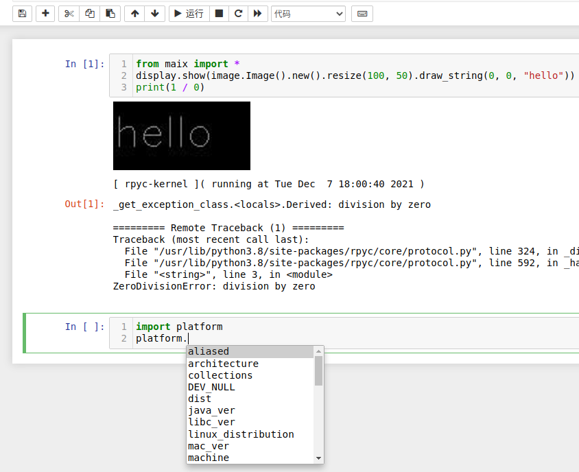

<p align="center">
    <h1 align="center"> RPyC の IPykernel </h1>
</p>

[](./LICENSE)
[](https://badge.fury.io/py/rpyc-ikernel)



## Kernel introduction

Inherit the IPythonKernel (iPython) class, and support low-end hardware (armv7l) for Python programming and real-time image and video streaming with less occupation 16M.

- Implement remote call (RPC) core through [rpyc](https://github.com/tomerfiliba-org/rpyc), see this [docs](http://rpyc.readthedocs.org/).

- Set up an RPC service for the remote machine with [MaixPy3](https://github.com/sipeed/MaixPy3) and transfer the local code to the remote (remote) to run & display images & get results.

### Special functions

| Command format | Command function | How to use |
| ---- | ---- | ---- |
| $connect("localhost") | Connect to the remote IP address (for example: "192.168.44.171:18812") | [usage_connect.ipynb](./tests/usage_connect.ipynb) |

## installation method

Explain in the following order:

- Configure rpyc service for [Remote Python].
- Install jupyter environment for [Local Python].

## Configure rpyc service for [Remote Python].

Use **ifconfig** or **ipconfig** on your remote device to get your IP address, please make sure that the address can be **ping**.

### MaixPy3 series

Make sure that the remote device is configured in the **Python3** environment, enter `pip3 install maixpy3` to install the **rpyc** service, copy the following command and run it to start the service.

```shell
python -c "import maix.mjpg;maix.mjpg.start()"
```

### Other environmental

The following code provides the remote call environment.

```python
try:
  from rpyc.utils.server import ThreadedServer
  from rpyc.core.service import SlaveService
  rpyc_server = ThreadedServer(
      SlaveService, hostname=HostName, port=RpycPort, reuse_addr=True)
  rpyc_server.start()
except OSError as e:
  # logging.debug('[%s] OSError: %s' % (__file__, str(e))) # [Errno 98] Address already in use
  exit(0)
```

At this time your rpyc service has been up.

## Install jupyter environment for [local Python].

Take Python3 as an example, please make sure that the basic environment/commands of python3 and pip3 have been installed, just call the code under the command line.

```shell
pip3 install rpyc_ikernel && python3 -m rpyc_ikernel.install
```

Tsinghua source can be used for domestic download acceleration.

```shell
pip3 install -i https://pypi.tuna.tsinghua.edu.cn/simple rpyc_ikernel && python3 -m rpyc_ikernel.install
```

After the above package is installed, enter `jupyter notebook` to start the service. After startup, the system default browser will be opened automatically (recommended foreign Google browser or domestic 360 speed browser), please select the kernel of rpyc and create a new (new) designation The code file of the kernel.


If you don't see it, you can enter `python3 -m rpyc_ikernel.install` to complete the kernel installation, and you can see it now.

### On Windows

If there are the following common errors that cannot find modules, they are common in py2 and py3 environments. Please confirm whether the system environment variable is python / pip command.

- `/usr/bin/python3: Error while finding module specification for'rpyc-ikernel.install' (ModuleNotFoundError: No module named'rpyc-ikernel')`
- `/usr/bin/python: No module named rpyc-ikernel`

> For some machine environment variables, python3 is python, or multiple versions of python and pip coexist, then the python command is required at this time.

You can enter `jupyter kernelspec list` to view the currently installed jupyter kernel. If there is no rpyc, the kernel is not installed.

```shell
Available kernels:
  bash /home/juwan/.local/share/jupyter/kernels/bash
  micropython /home/juwan/.local/share/jupyter/kernels/micropython
  python3 /home/juwan/.local/share/jupyter/kernels/python3
  rpyc /home/juwan/.local/share/jupyter/kernels/rpyc
```

## Run Python code in Notebook

Before running the code, please configure the IP address to connect, otherwise it will connect to the "localhost" address to request the service by default.

```python
$connect("192.168.43.44")
import platform
print(platform.uname())
```

It can be seen that the returned results are as follows:

```shell
uname_result(system='Linux', node='linux-lab', release='5.4.0-56-generic', version='#62-Ubuntu SMP Mon Nov 23 19:20:19 UTC 2020', machine= 'x86_64', processor='x86_64')
```

## common problem

You can troubleshoot problems in the following order:

### Environmental issues

When you find that there is no response after the Python code is executed, you can follow the steps below to troubleshoot the error.

- Check if the rpyc service of the remote device exists/runs. (Ps -a)
- If pressing the interrupt button fails to stop while the code is still running, please refresh the code page or restart the kernel and try to execute the code again.
- Restart the jupyter service and reconnect to the remote device to execute code.

If it still does not work, it may be a network problem, so continue to troubleshoot.

### Internet problem

Make sure that the local machine can connect to the remote machine, and use Ping or socket to connect.

- Determine the network to which the machine belongs, and try to ping the IP address of the slave machine.
- Determine the network to which the remote end belongs, and try to ping the host IP address.
- Make sure that the forwarding rules of the upper router do not restrict the service ports 18811, 18812, 18813.

### other problems

Unplug the network cable or restart the machine, reset the hardware and other reset operations.

## Design inspiration

The kernel design is taken from the following Python repository.

- [maixpy3](https://github.com/sipeed/maixpy3)
- [ipykernel](https://github.com/ipython/ipykernel)
- [rpyc](https://github.com/tomerfiliba-org/rpyc)

The reference kernel is as follows.

- [bash_kernel](https://github.com/takluyver/bash_kernel)
- [ubit_kernel](https://github.com/takluyver/ubit_kernel)
- [remote_ikernel](https://github.com/tdaff/remote_ikernel)
- [jupyter_micropython_kernel](https://github.com/goatchurchprime/jupyter_micropython_kernel)
